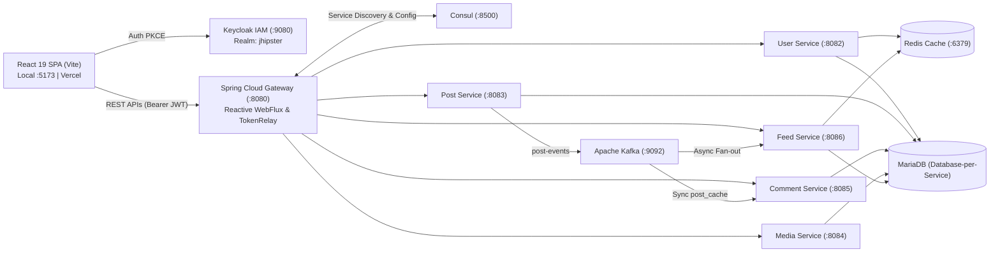

# Fakebook - Microservices Social Network Platform

[](https://github.com/MinhElly/fakebook/actions/workflows/ci.yml)
[](LICENSE)
[](https://www.oracle.com/java/)
[](https://spring.io/projects/spring-boot)
[](https://react.dev/)

**Fakebook** là nền tảng mạng xã hội phân tán hiện đại được xây dựng theo kiến trúc **Microservices** hướng sự kiện (Event-Driven Architecture). Hệ thống kết hợp sức mạnh của hệ sinh thái **Java 21 / Spring Boot / JHipster 9.3**, giao diện người dùng **React 19 / Vite / Tailwind CSS v4**, cùng hạ tầng phân tán **Keycloak, Consul, Kafka, MariaDB và Redis**.

---

## 1. Tóm tắt Kiến trúc (Architecture Summary)



---

## 2. Công nghệ cốt lõi (Tech Stack)

- **Frontend**: React 19, TypeScript 5.7, Vite 8, Tailwind CSS v4, `keycloak-js`, Axios.
- **API Gateway**: Spring Cloud Gateway (Reactive WebFlux), Spring Security OAuth2 TokenRelay.
- **Backend Services**: Spring Boot 3.4.x, Java 21 (Temurin), Spring Data JPA / JDBC, OpenFeign, Spring Cloud Stream.
- **Identity & Access Management (IAM)**: Keycloak 26 (OAuth2 / OIDC, Google Identity Provider).
- **Service Discovery & Config**: HashiCorp Consul 2.0.3, `consul-config-loader`.
- **Message Streaming**: Apache Kafka Native 4.3.1 (KRaft mode).
- **Lưu trữ & Caching**: MariaDB 12.3 (Database-per-service), Redis 8.1 (Sorted Sets Timeline & Cache).
- **Triển khai & CI/CD**: Docker, Docker Compose, GitHub Actions, Google Maven Jib, GHCR, Vercel, Azure VM, AWS RDS MariaDB.

---

## 3. Khởi động nhanh (Quick Start - 3 Bước)

### Bước 1: Khởi động Hạ tầng Docker (Local Infrastructure)
```powershell
# Tạo file .env từ template và nạp biến môi trường
Copy-Item infrastructure/.env.example infrastructure/.env
. .\infrastructure\load-dev-env.ps1

# Bật toàn bộ container hạ tầng (MariaDB, Keycloak, Consul, Kafka, Redis, Zipkin)
.\infrastructure\start.ps1
```

### Bước 2: Khởi động Backend Microservices (Máy Host JVM)
> Chạy Gateway trước, sau đó mở các tab terminal riêng cho từng service:
```powershell
# Chạy Gateway (Port 8080)
cd gateway; .\mvnw.cmd spring-boot:run '-Dspring-boot.run.arguments=--spring.docker.compose.enabled=false'

# Chạy các service cần thiết (User, Post, Feed, Comment, Media)
cd userService; .\mvnw.cmd spring-boot:run '-Dspring-boot.run.arguments=--spring.docker.compose.enabled=false'
cd postService; .\mvnw.cmd spring-boot:run '-Dspring-boot.run.arguments=--spring.docker.compose.enabled=false'
cd feedService; .\mvnw.cmd spring-boot:run '-Dspring-boot.run.arguments=--spring.docker.compose.enabled=false'
```

### Bước 3: Khởi động Frontend Web
```bash
cd frontend
npm install
npm run dev
```
Truy cập ứng dụng tại: **`http://localhost:5173`** (Đăng nhập với user mẫu: `admin` / `admin` hoặc `user` / `user`).

---

## 4. Cấu trúc Repository

```text
fakebook/
├── gateway/              # API Gateway & Reverse Proxy (Port 8080)
├── userService/          # Quản lý hồ sơ, bạn bè & theo dõi (Port 8082)
├── postService/          # Quản lý bài đăng & reactions (Port 8083)
├── commentService/       # Quản lý bình luận & PostCache (Port 8085)
├── mediaService/         # Quản lý upload Cloudinary & dọn dẹp media (Port 8084)
├── feedService/          # Bảng tin cá nhân hóa & Redis Fan-out (Port 8086)
├── authService/          # JHipster skeleton microservice (Port 8081)
├── frontend/             # Giao diện người dùng React 19 SPA
├── infrastructure/       # Docker Compose dev/staging, scripts & central config
├── performance/          # Kịch bản kiểm thử tải k6
├── scripts/              # E2E Smoke Test script
└── docs/                 # Toàn bộ tài liệu kỹ thuật chi tiết
```

---

## 5. Danh mục Tài liệu Kỹ thuật (Documentation Index)

Chi tiết về thiết kế kiến trúc, hướng dẫn phát triển và vận hành được tổ chức chuyên sâu trong thư mục [`docs/`](docs/):

- 📖 **Tổng quan dự án**:
  - [Project Overview](docs/01-overview/project-overview.md) | [System Context (C4)](docs/01-overview/system-context.md) | [Glossary](docs/01-overview/glossary.md)
- 🏛️ **Kiến trúc hệ thống**:
  - [System Architecture](docs/02-architecture/system-architecture.md) | [Microservices Spec](docs/02-architecture/microservices.md) | [Request Flow](docs/02-architecture/request-flow.md)
  - [Authentication Flow](docs/02-architecture/authentication-flow.md) | [Kafka Event-Driven](docs/02-architecture/kafka-architecture.md) | [Redis Caching](docs/02-architecture/caching.md) | [Data Flow](docs/02-architecture/data-flow.md)
- 💻 **Phát triển mã nguồn**:
  - [Local Setup Guide](docs/03-development/local-setup.md) | [Project Structure](docs/03-development/project-structure.md) | [Environment Variables](docs/03-development/environment-variables.md)
  - [Coding Guidelines](docs/03-development/coding-guidelines.md) | [Troubleshooting Guide](docs/03-development/troubleshooting.md)
- 🔌 **Đặc tả API**:
  - [API Overview](docs/04-api/api-overview.md) | [Inter-Service Communication](docs/04-api/service-communication.md)
- 🗄️ **Cơ sở dữ liệu**:
  - [Database Architecture](docs/05-database/database-architecture.md) | [Database Migration (Liquibase)](docs/05-database/database-migration.md)
- 🚀 **Triển khai & Vận hành**:
  - [Deployment Overview](docs/06-deployment/deployment-overview.md) | [Local Dev](docs/06-deployment/dev.md) | [Staging Server](docs/06-deployment/staging.md) | [Production Plan](docs/06-deployment/production.md) | [CI/CD Pipeline](docs/06-deployment/ci-cd.md)
  - [Operations Runbook](docs/07-operations/runbook.md) | [Monitoring (Zipkin)](docs/07-operations/monitoring.md) | [Health Checks](docs/07-operations/health-checks.md)
- 🧪 **Kiểm thử chất lượng**:
  - [Testing Strategy](docs/08-testing/testing-strategy.md) | [k6 Load Testing](docs/08-testing/load-testing.md)
- 📑 **Quyết định kiến trúc (ADR)**:
  - [Architecture Decision Records (ADR 001 - 006)](docs/adr/README.md)
