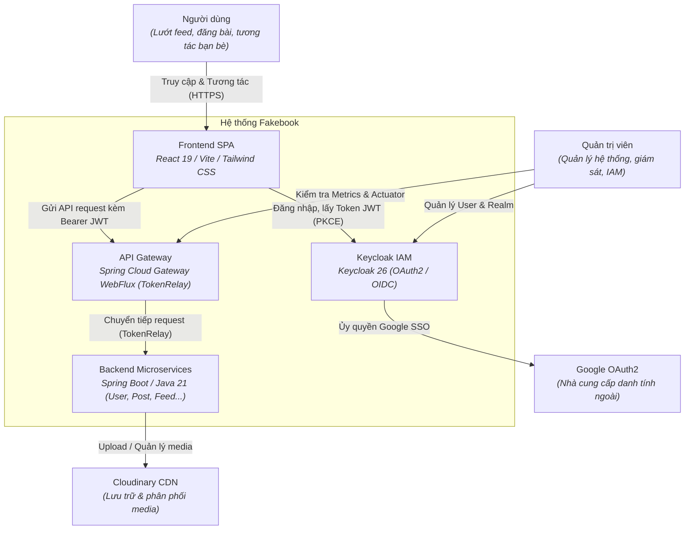

# System Context (Bối cảnh hệ thống)

Tài liệu này mô tả sơ đồ ngữ cảnh hệ thống (C4 System Context) và các tác nhân tương tác với hệ thống Fakebook.

---

## 1. Tác nhân (Actors)

| Tác nhân | Mô tả vai trò | Giao diện tương tác |
| :--- | :--- | :--- |
| **Người dùng cuối (End User)** | Người dùng duyệt bảng tin, đăng bài, bình luận, kết bạn, upload ảnh. | Trình duyệt Web (React SPA) |
| **Quản trị viên (Admin)** | Quản lý người dùng, cấu hình Realm, client Keycloak, xem metrics hệ thống. | Keycloak Admin Console (`:9080`), Consul UI (`:8500`), Kafka UI (`:8088`), Zipkin UI (`:9411`) |
| **Hệ thống thứ 3 (Google OAuth2)** | Cung cấp định danh mạng xã hội cho tính năng "Đăng nhập với Google". | Google Identity Services API |
| **Cloudinary CDN** | Dịch vụ đám mây lưu trữ và tối ưu hóa hình ảnh/video thực tế. | Cloudinary REST API |

---

## 2. Sơ đồ bối cảnh hệ thống (Mermaid)

---

## 3. Ranh giới mạng & Giao tiếp

1. **Vùng công khai (Public Internet)**:
   - **Frontend App**: Truy cập trực tiếp từ máy khách (Web Browser).
   - **Keycloak IAM**: Công khai các endpoint OIDC (`/realms/jhipster/protocol/openid-connect/*`) để client thực hiện xác thực và refresh token.
   - **API Gateway**: Công khai endpoint `/services/**` và `/api/**` để nhận các yêu cầu nghiệp vụ.
2. **Vùng nội bộ (Private / Docker Network)**:
   - Toàn bộ các microservices (`userService`, `postService`, `commentService`, `mediaService`, `feedService`, `authService`) không mở cổng trực tiếp ra ngoài Internet trong môi trường Staging/Production. Mọi luồng vào đều bắt buộc phải qua Gateway hoặc Nginx.
   - Các dịch vụ nền tảng: **Consul**, **Kafka Broker**, **MariaDB Server**, **Redis**, **Zipkin** nằm hoàn toàn trong mạng nội bộ.
