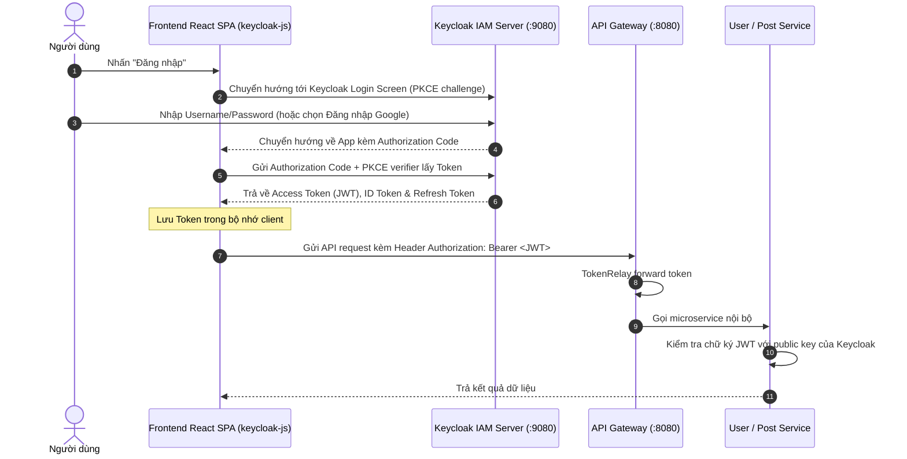
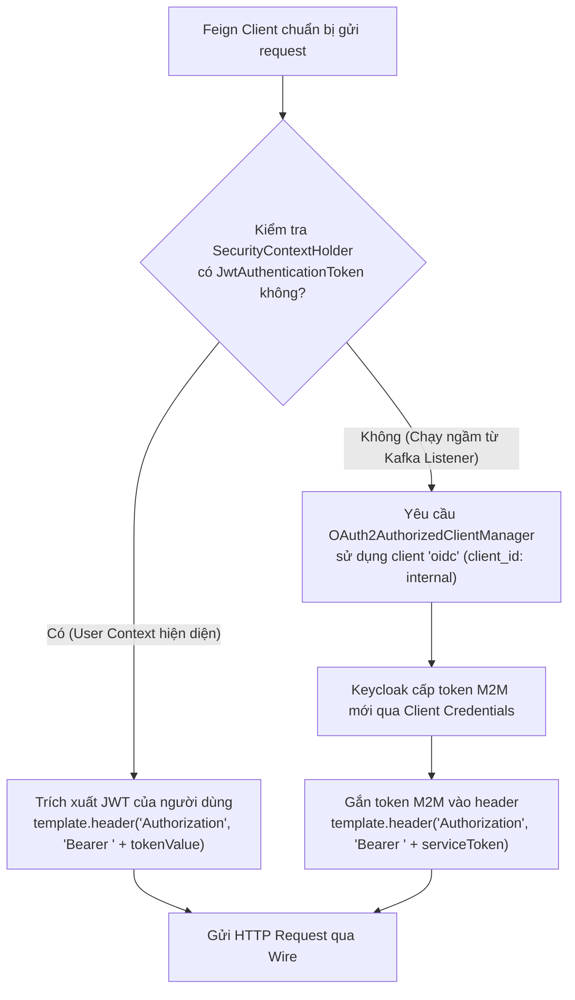

# Authentication & Authorization Architecture (Xác thực & Phân quyền)

Tài liệu này giải thích toàn diện về kiến trúc danh tính, xác thực và ủy quyền trong Fakebook sử dụng chuẩn **OAuth2** và **OpenID Connect (OIDC)** trên nền tảng **Keycloak 26**.

---

## 1. Keycloak Architecture & Realm Configuration

- **Realm**: `jhipster`
- **Clients chính trong Realm**:
  1. **`web_app` (Public Client)**:
     - Dành cho Frontend React SPA và Gateway.
     - Luồng xác thực: **Authorization Code Flow với PKCE (Proof Key for Code Exchange)**.
     - Không cần client secret ở phía trình duyệt (bảo mật tối đa theo khuyến nghị OAuth2 RFC 7636).
     - Redirect URIs hợp lệ:
       - Dev: `http://localhost:5173/*`, `http://localhost:9000/*`, `http://localhost:8080/*`
       - Staging: `https://fakebook-zeta.vercel.app/*`, `https://20-189-114-210.nip.io/*`
  2. **`internal` (Confidential Client)**:
     - Dành cho các giao tiếp liên dịch vụ ngầm (Service-to-Service M2M) khi không có người dùng tương tác trực tiếp (ví dụ: Kafka consumer trong `feedService` gọi sang `userService`).
     - Luồng xác thực: **Client Credentials Grant**.
     - Service Account Roles: Đầy đủ quyền gọi các API nội bộ.
     - Cấu hình qua script `infrastructure/keycloak/configure-internal-client.sh`.

---

## 2. Luồng xác thực người dùng (User Authentication Flow)



---

## 3. Luồng xác thực liên dịch vụ (M2M Hybrid Token Relay)

Một thách thức lớn trong kiến trúc Microservices là: **Làm thế nào để các microservice gọi lẫn nhau qua OpenFeign khi có user context HOẶC khi chạy bất đồng bộ từ Kafka (không có user context)?**

Fakebook giải quyết vấn đề này bằng một **Hybrid Token Relay Interceptor** (`TokenRelayRequestInterceptor.java`):



### Source Code mẫu thực tế (`feedService`):

```java
@Component
public class TokenRelayRequestInterceptor implements RequestInterceptor {
    private final OAuth2AuthorizedClientManager authorizedClientManager;

    public TokenRelayRequestInterceptor(OAuth2AuthorizedClientManager authorizedClientManager) {
        this.authorizedClientManager = authorizedClientManager;
    }

    @Override
    public void apply(RequestTemplate template) {
        Authentication authentication = SecurityContextHolder.getContext().getAuthentication();
        // 1. Nếu có User context: Relay token của User
        if (authentication instanceof JwtAuthenticationToken jwtAuth) {
            template.header("Authorization", "Bearer " + jwtAuth.getToken().getTokenValue());
            return;
        }

        // 2. Nếu không có User context (Kafka async): Lấy token M2M từ client_credentials
        OAuth2AuthorizeRequest authorizeRequest = OAuth2AuthorizeRequest.withClientRegistrationId("oidc")
            .principal("feed-service-internal")
            .build();
        OAuth2AuthorizedClient authorizedClient = authorizedClientManager.authorize(authorizeRequest);
        if (authorizedClient != null && authorizedClient.getAccessToken() != null) {
            template.header("Authorization", "Bearer " + authorizedClient.getAccessToken().getTokenValue());
        }
    }
}
```

---

## 4. Cấu hình Google Identity Provider (Google SSO)

Hệ thống hỗ trợ đăng nhập 1-chạm bằng tài khoản Google:
1. Tạo OAuth Client ID & Secret trên Google Cloud Console.
2. Thiết lập Redirect URI: `https://<domain>/realms/jhipster/broker/google/endpoint`.
3. Khi container Keycloak khởi động, script `infrastructure/keycloak/configure-google-idp.sh` tự động tạo hoặc cập nhật Identity Provider `google` trong Realm `jhipster` bằng Keycloak Admin CLI (`kcadm.sh`).
