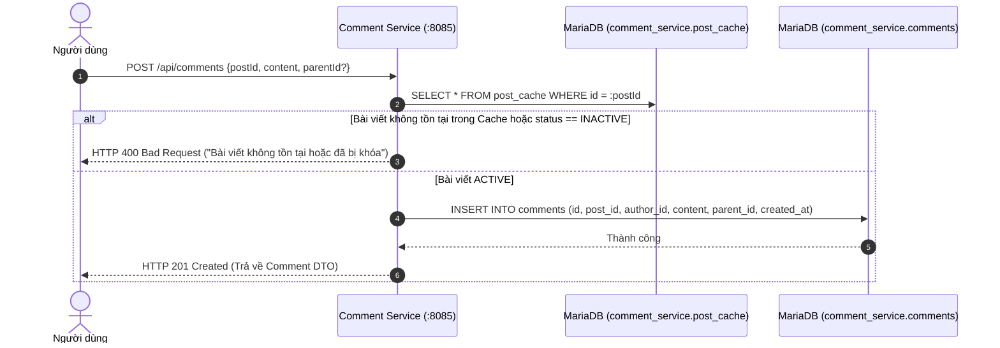
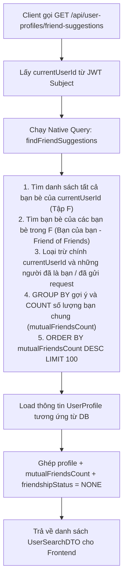

# Core Business Data Flows (Luồng dữ liệu nghiệp vụ chính)

Tài liệu này tổng hợp 3 luồng dữ liệu nghiệp vụ phức tạp và quan trọng nhất trong Fakebook, thể hiện sự phối hợp chặt chẽ giữa Frontend, Gateway, Microservices, Database, Redis và Kafka.

---

## 1. Luồng 1: Đăng bài viết kèm Media và Phân phối Feed (Post & Fan-out Flow)

```mermaid
flowchart TD
    subgraph Step1["1. Tải ảnh/video lên Cloudinary"]
        A[User chọn file ảnh] --> B[Frontend gọi POST /services/mediaservice/api/media/upload]
        B --> C[MediaService đẩy file lên Cloudinary CDN]
        C --> D[Lưu metadata vào DB mediaservice và trả về Media UUID]
    end

    subgraph Step2["2. Đăng bài viết"]
        D --> E[Frontend gọi POST /services/postservice/api/posts<br/>kèm danh sách mediaIds]
        E --> F[PostService lưu bài vào DB postservice]
        F --> G[Lưu bản ghi liên kết vào bảng post_media]
    end

    subgraph Step3["3. Bắn sự kiện qua Kafka"]
        G --> H[PostService bắn PostCreatedEvent sang topic post-events]
    end

    subgraph Step4["4. Xử lý bất đồng bộ downstream"]
        H --> I[FeedService tiêu thụ event]
        H --> J[CommentService tiêu thụ event]
        
        I --> K[FeedService gọi Feign sang UserService lấy Friends & Followers]
        K --> L[Ghi FeedItem vào DB feedservice]
        L --> M[Đẩy postId vào Redis ZSet feed:user:{id}]
        
        J --> N[CommentService ghi hoặc cập nhật bản ghi post_cache]
    end
```

---

## 2. Luồng 2: Bình luận trên bài viết (Comment Flow with PostCache)

Để tối ưu hóa hiệu năng và độ độc lập giữa các service, `commentService` không gọi HTTP sang `postService` mỗi khi có người bình luận, mà sử dụng bảng cục bộ `post_cache`:



---

## 3. Luồng 3: Gợi ý kết bạn dựa trên bạn chung (Friend Suggestion Flow)

Trong `userService` (`UserProfileService.java`), thuật toán tìm kiếm gợi ý kết bạn hoạt động theo cơ chế tính toán số lượng bạn chung:


