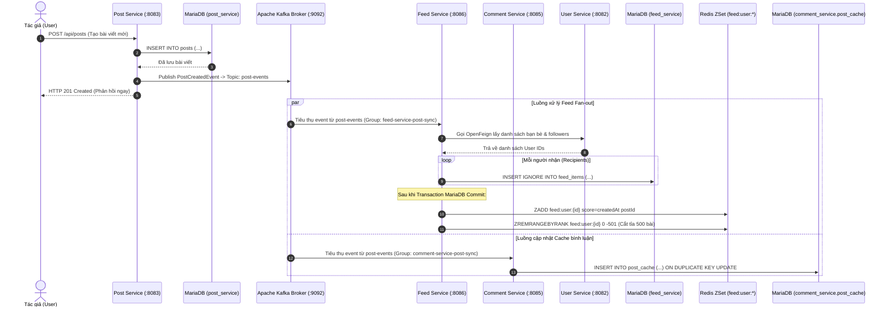

# Kafka Event-Driven Architecture (Kiến trúc hướng sự kiện với Kafka)

Tài liệu này đặc tả toàn bộ hệ thống sự kiện bất đồng bộ qua **Apache Kafka Native (KRaft mode)** trong Fakebook.

---

## 1. Bảng danh mục Kafka Topics & Consumer Groups

| Topic | Producer (Service) | Consumer (Service) | Consumer Group | Mục đích nghiệp vụ | DLQ / Retry |
| :--- | :--- | :--- | :--- | :--- | :--- |
| **`post-events`** | `postService` | `feedService` | `feed-service-post-sync` | Phân phối bài viết mới vào feed của bạn bè & followers (Fan-out). | **DLQ**: `post-events-feed-dlt`<br/>Max attempts: 3, Backoff: 1000ms (x2.0) |
| **`post-events`** | `postService` | `commentService` | `comment-service-post-sync` | Đồng bộ dữ liệu bài viết vào bảng `post_cache` cục bộ để validate khi tạo comment. | **DLQ**: `post-events-dlt`<br/>Max attempts: 3 |
| **`media-cleanup-topic`** | `postService`<br/>`userService` | `mediaService` | `media-service` | Xóa ảnh/video trên Cloudinary và trong database khi bài viết bị xóa hoặc khi user đổi avatar/cover. | Mặc định retry của Spring Cloud Stream |
| **`friendship-events-topic`** | `userService` | *(Chưa có consumer)* | - | Thông báo trạng thái kết bạn thay đổi (sẵn sàng tích hợp thông báo real-time sau này). | - |

---

## 2. Sơ đồ chuỗi phân phối sự kiện bài viết (Post Event Fan-out Sequence)



---

## 3. Cấu trúc Message Payload

Các message trên topic `post-events` tuân thủ chuẩn `EventEnvelope`:

```json
{
  "eventType": "POST_CREATED",
  "timestamp": "2026-09-22T10:15:30.123Z",
  "data": {
    "id": "c7a8b9e0-1234-5678-9abc-def012345678",
    "authorId": "a1b2c3d4-e5f6-7890-abcd-ef1234567890",
    "content": "Chào mừng đến với Fakebook!",
    "visibility": "PUBLIC",
    "status": "ACTIVE",
    "createdAt": "2026-09-22T10:15:30Z"
  }
}
```

Các loại `eventType`:
- `POST_CREATED`: Bài viết mới được xuất bản -> Feed fan-out, PostCache insert.
- `POST_UPDATED`: Cập nhật nội dung hoặc đổi quyền riêng tư (`PRIVATE` / `INACTIVE` -> kích hoạt xóa khỏi feed bạn bè).
- `POST_DELETED`: Xóa bài viết -> Xóa feed items trong MariaDB & Redis, xóa khỏi `post_cache`, đồng thời phát event lên `media-cleanup-topic`.

---

## 4. Cơ chế chịu lỗi (Fault Tolerance, Retry & Dead Letter Queue)

- **Cấu hình Spring Cloud Stream Consumer**:
  ```yaml
  spring:
    cloud:
      stream:
        bindings:
          processPostEvent-in-0:
            destination: post-events
            group: feed-service-post-sync
            consumer:
              max-attempts: 3
              back-off-initial-interval: 1000
              back-off-multiplier: 2.0
        kafka:
          bindings:
            processPostEvent-in-0:
              consumer:
                enable-dlq: true
                dlq-name: post-events-feed-dlt
                auto-commit-offset: false
  ```
- **Hành vi khi có lỗi**:
  1. Khi việc xử lý event thất bại (ví dụ: mất kết nối tạm thời sang User Service hoặc Redis), consumer thử lại tối đa 3 lần với khoảng thời gian chờ tăng dần (1s -> 2s -> 4s).
  2. Nếu sau 3 lần vẫn thất bại, message tự động được đẩy vào Dead Letter Topic (`post-events-feed-dlt`) để tránh làm tắc nghẽn offset của partition chính.
  3. Quản trị viên có thể kiểm tra các message lỗi trên DLQ thông qua **Kafka UI** tại `http://localhost:8088`.
