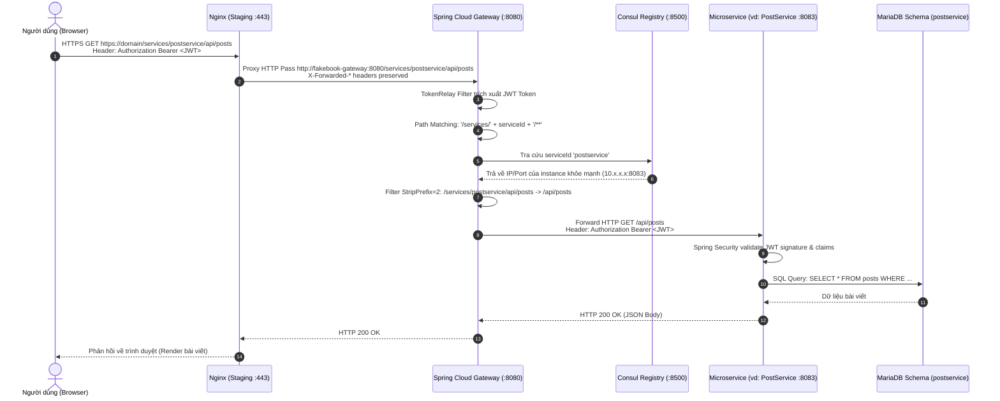

# Synchronous Request Flow (Luồng yêu cầu đồng bộ)

Tài liệu này mô tả chi tiết đường đi của một HTTP Request đồng bộ từ khi người dùng thao tác trên trình duyệt cho tới khi nhận được phản hồi từ cơ sở dữ liệu của microservice tương ứng.

---

## 1. Sơ đồ tuần tự tổng quát (Mermaid Sequence Diagram)



---

## 2. Quy tắc định tuyến động trên API Gateway

Spring Cloud Gateway được cấu hình kích hoạt `discovery.locator`:

```yaml
spring:
  cloud:
    gateway:
      server:
        webflux:
          default-filters:
            - TokenRelay
          discovery:
            locator:
              enabled: true
              lower-case-service-id: true
              predicates:
                - name: Path
                  args:
                    pattern: "'/services/'+serviceId+'/**'"
              filters:
                - StripPrefix=2
```

### Giải thích quy tắc:
1. **Tiền tố chuẩn `/services/{serviceId}/`**:
   - `serviceId` được định nghĩa bằng chữ thường (lower case) khớp với tên đăng ký trên Consul: `userservice`, `postservice`, `commentservice`, `mediaservice`, `feedservice`, `authservice`.
2. **Cơ chế cắt tiền tố (`StripPrefix=2`)**:
   - Phần `/services/{serviceId}` gồm 2 phần tử đường dẫn đầu tiên sẽ bị cắt bỏ trước khi chuyển tới microservice downstream.
   - Ví dụ:
     - URL client gọi: `http://localhost:8080/services/userservice/api/user-profiles`
     - URL microservice nhận được: `http://localhost:8082/api/user-profiles`
3. **Cơ chế `TokenRelay`**:
   - Mặc định mọi request đi qua locator đều được áp dụng filter `TokenRelay`. Bộ lọc này lấy header `Authorization: Bearer <token>` từ client và chuyển tiếp nguyên vẹn tới microservice, giúp bảo toàn định danh người dùng.

---

## 3. Quy tắc Reverse Proxy trên Nginx (Staging)

Trong môi trường Staging, Nginx đóng vai trò là tầng tiếp nhận đầu tiên trước khi vào Gateway:

```nginx
location /services/ {
    proxy_pass http://fakebook-gateway:8080/services/;
    proxy_http_version 1.1;
    proxy_set_header Upgrade $http_upgrade;
    proxy_set_header Connection "upgrade";
    proxy_set_header Host $host;
    proxy_set_header X-Real-IP $remote_addr;
    proxy_set_header X-Forwarded-For $proxy_add_x_forwarded_for;
    proxy_set_header X-Forwarded-Proto https;
    proxy_set_header X-Forwarded-Host $host;
    proxy_set_header X-Forwarded-Port 443;
}
```

Các proxy header `X-Forwarded-*` được bảo toàn đầy đủ giúp Spring Boot Gateway và Keycloak nhận diện đúng schema HTTPS và domain thật của client.
