# System Architecture (Kiến trúc hệ thống)

Tài liệu này cung cấp cái nhìn tổng thể về kiến trúc hệ thống phân tán của **Fakebook**, các tầng công nghệ, ranh giới dịch vụ và cách thức các thành phần kết nối với nhau.

---

## 1. Sơ đồ kiến trúc tổng thể (Mermaid Architecture Diagram)

```mermaid
flowchart TD
    subgraph Client_Tier["Client Tier (Trình duyệt)"]
        Browser["React 19 SPA (Vite / Tailwind CSS)<br/>Local :5173 | Staging: Vercel"]
    end

    subgraph Edge_Security["Edge & Reverse Proxy Tier"]
        Nginx["Nginx Reverse Proxy & SSL (Staging :443)<br/>Let's Encrypt TLS Termination"]
        Keycloak["Keycloak IAM (:9080)<br/>OAuth2 / OIDC / Realm: jhipster<br/>Clients: web_app, internal"]
    end

    subgraph Gateway_Tier["API Gateway Tier"]
        Gateway["Spring Cloud Gateway (:8080)<br/>WebFlux Reactive + TokenRelay<br/>R2DBC DB: gateway"]
    end

    subgraph Service_Mesh_Infra["Discovery & Configuration"]
        Consul["HashiCorp Consul (:8500)<br/>Service Registry & KV Config Store"]
        ConfigLoader["Consul Config Loader<br/>Loads central-server-config/*.yml"]
    end

    subgraph Core_Microservices["Core Microservices Tier"]
        UserService["User Service (:8082)<br/>Spring Boot / JDBC: userservice<br/>Profiles, Friendships, Follows"]
        PostService["Post Service (:8083)<br/>Spring Boot / JDBC: postservice<br/>Posts, PostMedias, Reactions"]
        CommentService["Comment Service (:8085)<br/>Spring Boot / JDBC: commentservice<br/>Comments, Reactions, PostCache"]
        MediaService["Media Service (:8084)<br/>Spring Boot / JDBC: mediaservice<br/>Cloudinary Metadata & Upload"]
        FeedService["Feed Service (:8086)<br/>Spring Boot / JDBC: feedservice<br/>Personalized News Feed"]
        AuthService["Auth Service (:8081)<br/>Spring Boot / JDBC: authservice<br/>JHipster Skeleton Service"]
    end

    subgraph Storage_Caching["Storage & Caching Tier"]
        MariaDB[("MariaDB Server (:3307 Local / AWS RDS Staging)<br/>Separate Schemas per Service")]
        Redis[("Redis (:6379)<br/>Cacheable: UserProfiles<br/>Sorted Sets: feed:user:{id}")]
    end

    subgraph Event_Streaming["Asynchronous Messaging Tier"]
        Kafka["Apache Kafka Native (:9092 Local / :29092)<br/>Topics: post-events, media-cleanup-topic,<br/>friendship-events-topic, DLQ"]
        KafkaUI["Kafka UI (:8088)<br/>Topic & Consumer Management"]
    end

    subgraph Observability["Observability Tier"]
        Zipkin["OpenZipkin (:9411)<br/>Distributed Tracing (Micrometer)"]
    end

    subgraph External_Cloud["External Cloud Services"]
        Cloudinary["Cloudinary CDN API<br/>Image/Video Processing"]
        GoogleAuth["Google Identity Platform<br/>Social Login Provider"]
    end

    %% Client Interactions
    Browser -->|"1. Auth Login (PKCE)"| Keycloak
    Browser -->|"2. API Calls (Bearer JWT)"| Nginx
    Nginx -->|"Proxy /realms/**"| Keycloak
    Nginx -->|"Proxy /services/**, /api/**"| Gateway
    Browser -.->|"Direct in Local Dev"| Gateway

    %% Gateway & Registry
    Gateway <-->|"Service Lookup"| Consul
    Gateway -->|"Route: /services/userservice/**"| UserService
    Gateway -->|"Route: /services/postservice/**"| PostService
    Gateway -->|"Route: /services/commentservice/**"| CommentService
    Gateway -->|"Route: /services/mediaservice/**"| MediaService
    Gateway -->|"Route: /services/feedservice/**"| FeedService
    Gateway -->|"Route: /services/authservice/**"| AuthService

    %% Central Config
    ConfigLoader -->|"Populate KV"| Consul
    Core_Microservices <-->|"Discover & Fetch Config"| Consul

    %% Database connections
    Gateway -->|"R2DBC"| MariaDB
    UserService -->|"HikariCP"| MariaDB
    PostService -->|"HikariCP"| MariaDB
    CommentService -->|"HikariCP"| MariaDB
    MediaService -->|"HikariCP"| MariaDB
    FeedService -->|"HikariCP"| MariaDB
    AuthService -->|"HikariCP"| MariaDB
    Keycloak -->|"JDBC"| MariaDB

    %% Redis Cache
    UserService <-->|"Spring Cache"| Redis
    FeedService <-->|"ZSet Timeline Cache"| Redis

    %% Kafka Streaming
    PostService -->|"Publish: post-events"| Kafka
    PostService -->|"Publish: media-cleanup-topic"| Kafka
    UserService -->|"Publish: friendship-events-topic"| Kafka
    UserService -->|"Publish: media-cleanup-topic"| Kafka
    Kafka -->|"Consume: post-events"| FeedService
    Kafka -->|"Consume: post-events"| CommentService
    Kafka -->|"Consume: media-cleanup-topic"| MediaService

    %% Inter-service Sync (Feign)
    FeedService -.->|"OpenFeign (Hybrid Token)"| UserService
    CommentService -.->|"OpenFeign"| PostService
    CommentService -.->|"OpenFeign"| UserService
    PostService -.->|"OpenFeign"| UserServiceClient
    PostService -.->|"OpenFeign"| MediaServiceClient
    UserService -.->|"OpenFeign"| MediaServiceClient

    %% External
    MediaService -->|"Upload / Delete"| Cloudinary
    Keycloak -->|"SSO Federation"| GoogleAuth

    %% Observability
    Core_Microservices -.->|"Trace Spans"| Zipkin
    Gateway -.->|"Trace Spans"| Zipkin
```

---

## 2. Các tầng thành phần kiến trúc

### 2.1 Tầng Client (Frontend)
- Được xây dựng bằng **React 19**, **Vite**, **TypeScript**, và **Tailwind CSS v4**.
- Sử dụng thư viện chuẩn `keycloak-js` để xử lý xác thực theo luồng **OAuth2 Authorization Code Flow với PKCE**.
- Cấu hình runtime động: Không hardcode URL API lúc build bundle. Khi khởi chạy, file `runtime-config.ts` tải `/config/app-config.json` để xác định `apiBaseUrl` và `keycloakBaseUrl`.

### 2.2 Tầng Edge, SSL & Gateway
- **Nginx**: Trong môi trường Staging, Nginx đóng vai trò điểm vào duy nhất (Single Domain Ingress qua port 80/443).
  - Tự động chuyển hướng HTTP sang HTTPS.
  - Định tuyến `/realms/`, `/resources/`, `/admin/` về Keycloak container.
  - Định tuyến `/services/` và `/api/` về Spring Cloud Gateway.
  - Chuyển hướng trang gốc `/` sang ứng dụng Frontend trên Vercel.
- **Spring Cloud Gateway (port 8080)**:
  - Sử dụng kiến trúc bất đồng bộ không chặn (Non-blocking Reactive WebFlux).
  - Tích hợp Consul Discovery Locator: Tự động ánh xạ request theo format `/services/<service-id>/**` sang microservice đích và áp dụng filter `StripPrefix=2`.
  - Tích hợp `TokenRelay`: Tự động trích xuất token Bearer JWT từ request ban đầu và truyền tiếp xuống downstream services.

### 2.3 Tầng Service Discovery & Cấu hình tập trung (Consul)
- Hệ thống **không dùng Spring Cloud Config Server** mà sử dụng **HashiCorp Consul** cho cả 2 nhiệm vụ:
  1. **Service Discovery**: Mỗi microservice khi khởi động sẽ đăng ký tên định danh (ví dụ `userservice`, `postservice`) kèm health check path `/management/health`.
  2. **Centralized Configuration**: `consul-config-loader` đọc toàn bộ file YAML trong `infrastructure/config/central-server-config/` và ghi vào Consul KV Store theo cấu trúc key:
     - `config/application/data`
     - `config/application-dev/data` (hoặc staging)
     - `config/<serviceName>-<profile>/data`
  - Các service tải cấu hình này trong giai đoạn bootstrap của Spring Cloud. Tính năng dynamic config watch được tắt (`watch.enabled: false`) để tránh reload cấu hình runtime ngoài ý muốn.

### 2.4 Tầng Microservices nghiệp vụ
Hệ thống bao gồm 6 dịch vụ chính:
1. **User Service (8082)**: Quản lý User Profiles (ID khớp Keycloak UUID), lời mời kết bạn (FriendRequest), quan hệ bạn bè (Friendship), và quan hệ theo dõi (Follow).
2. **Post Service (8083)**: Tạo, chỉnh sửa, xóa bài viết; đính kèm danh sách media IDs; quản lý reactions.
3. **Comment Service (8085)**: Quản lý hệ thống bình luận đa cấp. Duy trì một bảng cache `post_cache` đồng bộ qua Kafka để kiểm tra tính hợp lệ của bài viết trước khi cho phép bình luận.
4. **Media Service (8084)**: Tích hợp với Cloudinary API để quản lý URL tải lên, kích thước, định dạng và metadata media; lắng nghe Kafka để dọn dẹp ảnh mồ côi.
5. **Feed Service (8086)**: Xây dựng bảng tin theo mô hình Fan-out on Write. Lắng nghe `post-events` từ Kafka, tra cứu bạn bè qua OpenFeign và lưu trữ feed vào cả MariaDB lẫn Redis ZSet.
6. **Auth Service (8081)**: JHipster skeleton microservice kết nối database `authservice`. Hệ thống hiện xác thực trực tiếp qua Keycloak IAM.

### 2.5 Tầng Lưu trữ, Caching & Event Streaming
- **MariaDB 12.3**: Triển khai theo mô hình Database-per-service. Mỗi service sở hữu một schema riêng. Trong môi trường staging, kết nối ra AWS RDS MariaDB thông qua TLS/SSL (chứng chỉ `rds-global-bundle.pem`).
- **Redis 8.1**: Sử dụng làm In-Memory Cache cho User Service (thông qua `@Cacheable`) và lưu trữ dòng thời gian bảng tin (Sorted Sets) cho Feed Service.
- **Apache Kafka Native (KRaft mode)**: Đóng vai trò xương sống truyền thông bất đồng bộ giữa các microservice, tích hợp Dead Letter Queue (DLQ) và cơ chế thử lại tự động (retry back-off).
