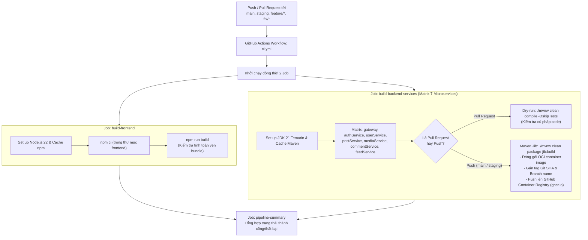

# CI/CD Pipeline Documentation

Tài liệu này đặc tả toàn bộ quy trình Tích hợp liên tục (**CI**) và Phân phối liên tục (**CD**) được cấu hình trong repository Fakebook thông qua **GitHub Actions** (`.github/workflows/ci.yml`).

---

## 1. Sơ đồ Pipeline tổng thể

---

## 2. Chi tiết các Jobs trong Pipeline

### 2.1 Job `build-frontend` (Kiểm thử giao diện)
- **Môi trường**: `ubuntu-latest`.
- **Node.js**: Phiên bản `22` (sử dụng cache npm dựa trên `frontend/package-lock.json`).
- **Nhiệm vụ**: Chạy `npm ci` và `npm run build` để đảm bảo code React/TypeScript không bị lỗi cú pháp, thiếu type hoặc lỗi import trước khi merge.

### 2.2 Job `build-backend-services` (Matrix Build OCI Image)
- **Cơ chế Matrix**: Chạy đồng thời 7 tác vụ độc lập cho 7 microservices:
  - `gateway` -> `fakebook-gateway`
  - `authService` -> `fakebook-authservice`
  - `userService` -> `fakebook-userservice`
  - `postService` -> `fakebook-postservice`
  - `mediaService` -> `fakebook-mediaservice`
  - `commentService` -> `fakebook-commentservice`
  - `feedService` -> `fakebook-feedservice`
- **Công nghệ đóng gói (Google Maven Jib)**:
  - Dự án sử dụng plugin **Jib** (`./mvnw compile jib:build`) thay vì `docker build`.
  - Ưu điểm: Đóng gói image OCI tiêu chuẩn trực tiếp từ bytecode Java mà không cần Docker daemon chạy trên runner, tận dụng cache tầng layer cực kỳ hiệu quả và tốc độ vượt trội.
- **Quy tắc gắn Tag Image**:
  - Mỗi image được push lên registry: `ghcr.io/<owner>/fakebook-<servicename>`.
  - Tag theo mã băm commit ngắn 7 ký tự: `:${SHORT_SHA}`.
  - Tag theo tên nhánh đã chuẩn hóa: `:${CLEAN_BRANCH}` (ví dụ: `:staging`).
  - Nếu nhánh là `main` hoặc `master`, gắn thêm tag `:latest` và `:main`.

---

## 3. Trạng thái Triển khai (Continuous Deployment Status)

> [!NOTE]
> **CD hiện tại là bán tự động (Semi-Automated)**:
> - **Frontend**: Vercel tự động nhận diện commit mới trên nhánh `staging` và kích hoạt deploy tức thì.
> - **Backend Microservices**: Pipeline CI hiện tại chỉ dừng lại ở bước đóng gói và đẩy image lên **GHCR**. Quá trình cập nhật image lên Azure VM Staging được thực thi bằng lệnh `docker compose pull && docker compose up -d` (xem chi tiết tại [staging.md](staging.md)).
