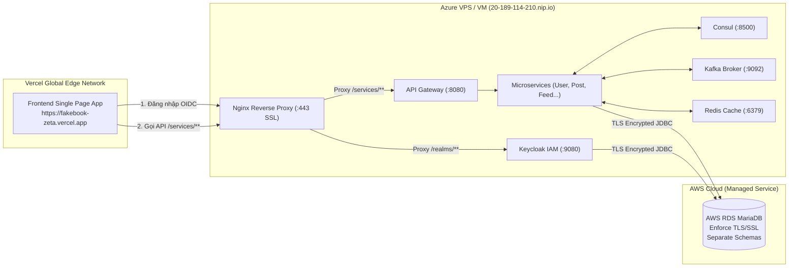

# Deployment Overview (Tổng quan Chiến lược Triển khai)

Tài liệu này tổng hợp mô hình triển khai của hệ thống Fakebook xuyên suốt các môi trường từ phát triển cục bộ (**Dev**), máy chủ thử nghiệm tích hợp (**Staging**) đến kế hoạch vận hành chính thức (**Production**).

---

## 1. Ma trận so sánh các Môi trường Triển khai

| Thành phần | Môi trường Local Dev | Môi trường Staging (Hiện tại) | Môi trường Production (Kế hoạch) |
| :--- | :--- | :--- | :--- |
| **Frontend** | Host Local (`localhost:5173`) | **Vercel** (`fakebook-zeta.vercel.app`) | Vercel / Cloud CDN (Custom Domain) |
| **Backend Services** | Máy Host (JVM Java 21) | **Docker Compose trên Azure VM** | Kubernetes Cluster (EKS / AKS) |
| **API Gateway** | Máy Host (`localhost:8080`) | Docker Container (Behind Nginx) | Ingress Controller / Cloud Gateway |
| **Reverse Proxy / SSL** | Không dùng (HTTP) | **Nginx Alpine + Let's Encrypt SSL** | Cloudflare / AWS ALB + ACM Certificate |
| **Identity Provider** | Keycloak Docker (`localhost:9080` H2/MariaDB) | Keycloak Docker (RDS MariaDB) | Managed IAM / Clustered Keycloak |
| **Cơ sở dữ liệu** | MariaDB Container (`localhost:3307`) | **AWS RDS MariaDB (TLS / SSL)** | Multi-AZ AWS RDS MariaDB Aurora |
| **Cache** | Redis Container (`localhost:6379`) | Redis Container (Mounted Volume) | AWS ElastiCache for Redis Cluster |
| **Message Broker** | Kafka Native Container (`localhost:9092`) | Kafka Native Container (Docker) | Managed Kafka (MSK / Confluent Cloud) |
| **Service Discovery** | Consul Container (`localhost:8500`) | Consul Container (Docker) | K8s Native DNS / Consul Cluster |
| **CI / CD Pipeline** | Thủ công qua Maven & npm | **GitHub Actions + Maven Jib + GHCR** | GitOps (ArgoCD) + Automated Testing |

---

## 2. Kiến trúc Staging Hybrid (Vercel + Azure VM + AWS RDS)

Môi trường Staging hiện tại được thiết kế theo mô hình lai (Hybrid Cloud Architecture) tận dụng thế mạnh của từng nền tảng:

1. **Frontend trên Vercel**: Tận dụng CDN toàn cầu của Vercel, thời gian build nhanh, tự động preview theo Pull Request.
2. **Backend trên Azure VM**: Toàn bộ các container backend và hạ tầng nội bộ chạy trong một mạng bridge Docker riêng biệt được điều phối qua `infrastructure/docker-compose-staging.yml`.
3. **Database trên AWS RDS**: Đảm bảo an toàn dữ liệu, tự động sao lưu, hỗ trợ mã hóa đường truyền bắt buộc (TLS/SSL).
